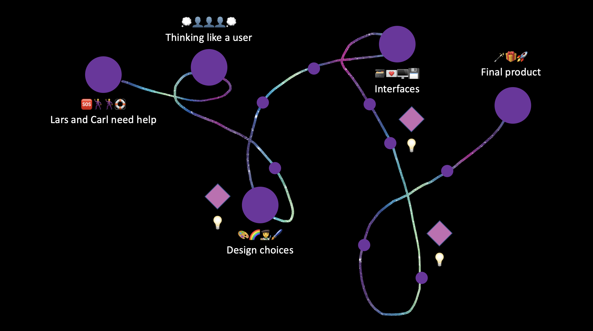
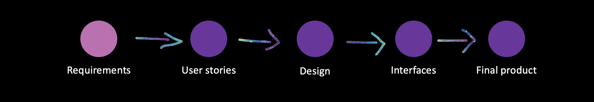
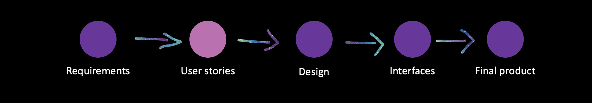
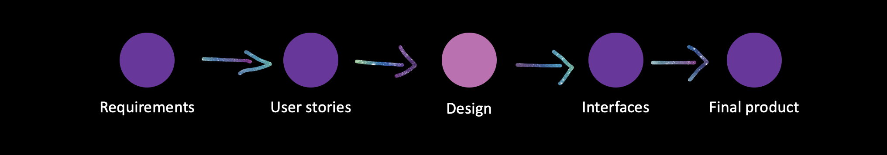
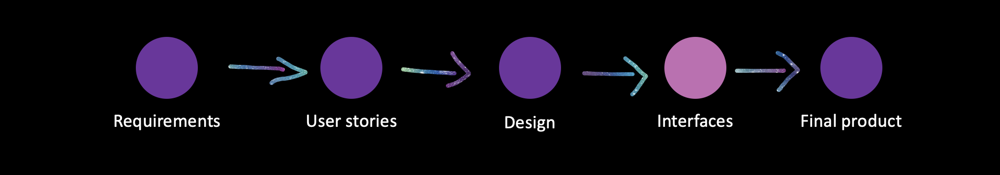
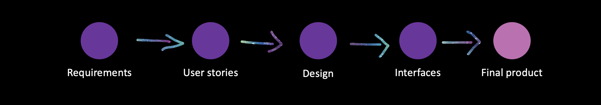
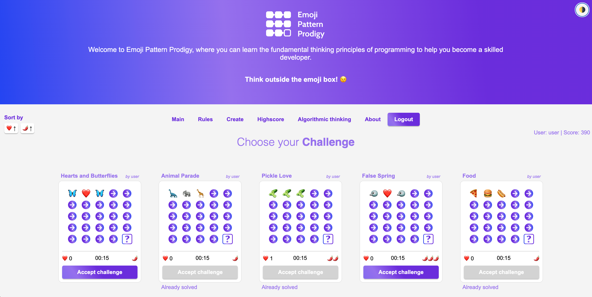

# Emoji Pattern Prodigy
## A project by Team Emojiteers

---slide---
## Showcase
### Come in and find out!

---slide---
## Join our Journey

---vert---

### Lars and Carl need help!

---vert---

### Thinking like a User.
<iframe style="border: 1px solid rgba(0, 0, 0, 0.1);" width="800" height="450" src="https://trello.com/b/xHKvw8tn.html" allowfullscreen></iframe>
---vert---

### Design choices
<iframe style="border: 1px solid rgba(0, 0, 0, 0.1);" width="800" height="450" src="https://www.figma.com/embed?embed_host=share&url=https%3A%2F%2Fwww.figma.com%2Ffile%2FLBk36Rgko8Hk7mhewKqlcu%2Fepp%3Fnode-id%3D0%253A1%26t%3DFBezmmhlZ9zgC6Yk-1" allowfullscreen></iframe>

---vert---

### Interfaces

---vert---

### Final product

---vert---
## Our Learnings

---vert---

## interesting code-snippet

<link rel="stylesheet" href="plugin/highlight/monokai.css">

<section>
<pre><code data-trim data-noescape data-line-numbers="1-2|3|4-11">
@HostListener('window:beforeunload', ['$event'])
onBeforeUnload() {
    if (this.isSolving == true) {
        let payload: SolvedDTO = {
            userName: sessionStorage.getItem("userName"),
            points: 0,
            matrixId: this.matrixId
            }
        this.http.post('http://localhost:8080/api/solved', payload).subscribe();
    }
}
</code> </pre>
</section>
---slide---

# Thank you!
# 🐈 🐿️ 🦋